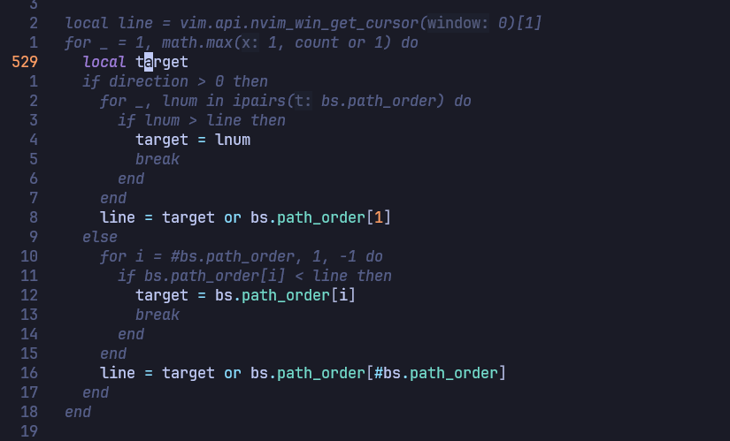

# tunnelvision.nvim


Focus on one thing at a time.

TunnelVision dims unrelated lines and keeps attention on the targeted symbol.



## Requirements

- Neovim `>= 0.9`
- Optional (recommended):
  - Tree-sitter for better scope detection
  - LSP with `documentHighlight`

## Installation

<details open>
<summary><code>lazy.nvim</code></summary>

```lua
{
  "leolaurindo/tunnelvision.nvim",
  opts = {},
}
```

</details>

<details>
<summary><code>vim.pack</code></summary>

```lua
vim.pack.add({ "https://github.com/leolaurindo/tunnelvision.nvim" })
require("tunnelvision").setup()
```

`vim.pack` is Neovim's built-in plugin manager in newer versions, and it is still experimental upstream.

</details>

<details>
<summary><code>mini.deps</code></summary>

```lua
MiniDeps.add({ source = "leolaurindo/tunnelvision.nvim" })
require("tunnelvision").setup()
```

</details>

<details>
<summary><code>packer.nvim</code></summary>

```lua
use({
  "leolaurindo/tunnelvision.nvim",
  config = function()
    require("tunnelvision").setup()
  end,
})
```

</details>

## Quick start

1. Put the cursor on a symbol.
2. Run `:TunnelVision on`.
3. Jump with `:TunnelVision next` and `:TunnelVision prev`.
4. Run `:TunnelVision off`.

## Commands

```text
:TunnelVision on|retarget|off|toggle|next|prev|refresh|status
:TunnelVision mode [static|dynamic|flow]
:TunnelVision scope [function|buffer]
:TunnelVision source [lsp_else_word|lsp|lsp_and_word|word]
:TunnelVision direction [forward|both]
```

With no value, `mode`, `scope`, `source`, and `direction` show the current setting.

Run `:help tunnelvision` for full command and option reference.

## Modes

- `static` (default): track the symbol selected on activation.
- `dynamic`: retarget as the cursor moves.
- `flow`: experimental mode that expands to assignment-related lines to follow value flow.

`scope = "function"` uses Tree-sitter when available, otherwise TunnelVision falls back to the full buffer.

`source = "lsp_else_word"` is the default and works well as a general setting.

## Configuration

```lua
require("tunnelvision").setup({
  mode = "static",
  scope = "function",
  source = "lsp_else_word",
})
```

| Option | Default | Notes |
| --- | --- | --- |
| `mode` | `static` | `dynamic` retargets as you move; `flow` is experimental. |
| `direction` | `forward` | Flow mode only. Use `both` to include backward influence. |
| `scope` | `function` | Uses the nearest function-like scope when Tree-sitter is available. |
| `source` | `lsp_else_word` | LSP first, then word matching when LSP data is unavailable. |
| `fallback_warn` | `once` | Controls fallback warnings for `lsp_else_word`. |
| `extra_keywords` | `{}` | Extra identifiers to ignore in flow analysis. |
| `lsp_timeout_ms` | `150` | Timeout for async LSP `documentHighlight` requests. |
| `dim_hl` | `TunnelVisionDim` | Highlight group used for dimmed lines. |
| `max_dim_lines` | `6000` | Skip dimming in very large buffers. |
| `notify` | `true` | Enable plugin notifications. |

Run `:help tunnelvision-config` for the full option reference.

## Suggested keymaps

```lua
local tv = require("tunnelvision")

vim.keymap.set("n", "<leader>v", "<cmd>TunnelVision on<CR>", { desc = "TunnelVision on" })
-- or vim.keymap.set("n", ""<leader>v", "<cmd>TunnelVision toggle<CR>", { desc = "TunnelVision toggle"})
vim.keymap.set("n", "]v", "<cmd>TunnelVision next<CR>", { desc = "TunnelVision next" })
vim.keymap.set("n", "[v", "<cmd>TunnelVision prev<CR>", { desc = "TunnelVision prev" })
vim.keymap.set("n", "<Esc>", function()
  if tv.is_active() then
    tv.off()
    return ""
  end
  return "<Esc>"
end, { expr = true, silent = true, desc = "TunnelVision off on Esc" })
```

## Health

- `:checkhealth tunnelvision`

## Contributing

Feel free to contribute.

Just make sure to:

- include your rationale
- update the documentation
