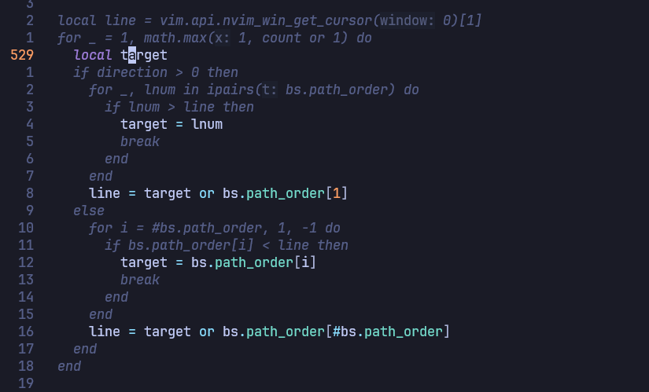

# tunnelvision.nvim


Focus on one thing at a time.

TunnelVision dims unrelated lines and keeps attention on the targeted symbol.



## Requirements

- Neovim `>= 0.9`
- Optional:
  - Tree-sitter for better scope detection (recommended, specially for LSP-free
    setups)
  - LSP with `documentHighlight`

## Installation

<details open>
<summary><code>lazy.nvim</code></summary>

```lua
{
  "leolaurindo/tunnelvision.nvim",
  opts = {},
}
```

</details>

<details>
<summary><code>vim.pack</code></summary>

```lua
vim.pack.add({ "https://github.com/leolaurindo/tunnelvision.nvim" })
require("tunnelvision").setup()
```

</details>

<details>
<summary><code>mini.deps</code></summary>

```lua
MiniDeps.add({ source = "leolaurindo/tunnelvision.nvim" })
require("tunnelvision").setup()
```

</details>

<details>
<summary><code>packer.nvim</code></summary>

```lua
use({
  "leolaurindo/tunnelvision.nvim",
  config = function()
    require("tunnelvision").setup()
  end,
})
```

</details>

## Quick start

1. Call `require("tunnelvision").setup()` so the `:TunnelVision` command is
   registered.
2. Put the cursor on a symbol.
3. Run `:TunnelVision on`.
4. Jump with `:TunnelVision next` and `:TunnelVision prev`.
5. Run `:TunnelVision off`.

## Commands

```text
:TunnelVision on|retarget|off|toggle|next|prev|refresh|status
:TunnelVision mode [static|dynamic|flow]
:TunnelVision scope [function|buffer]
:TunnelVision source [lsp|treesitter|word|lsp,word|treesitter,word|lsp,treesitter,word|lsp_else_word|lsp_and_word]
:TunnelVision direction [forward|both]
```

Run `:help tunnelvision` for full command and option reference.

## Modes

- `static` (default): track the symbol selected on activation.
- `dynamic`: retarget as the cursor moves.
- `flow`: experimental mode (requires word-enabled chain).

`scope = "function"` uses Tree-sitter when available, otherwise TunnelVision
falls back to the full buffer.

`sources = { "lsp", "word" }` is the default and works well as a general setting.
If LSP is slow or unavailable, TunnelVision falls back to `word` after
`lsp_timeout_ms`.

Since `0.3.0`, `treesitter` can also be used as a lightweight source fallback:
`sources = { "lsp", "treesitter", "word" }`.

For LSP-free setups, `sources = { "treesitter", "word" }` pairs well with
`scope = "function"`, because Tree-sitter keeps matching syntax-aware when a
parser is available, and word matching remains as a broad fallback.

## Configuration

### Defaults

Use `setup()` to define the persistent defaults used by `:TunnelVision on`,
`on()`, and runtime commands such as `:TunnelVision scope buffer`.

```lua
require("tunnelvision").setup({
  mode = "static",
  scope = "function",
  sources = { "lsp", "word" },
  flow_settings = {
    direction = "forward",
    extra_keywords = {},
  },
  highlights = { line = true },
  dim = nil,
})
```

By default, matched path lines keep their original colors and everything else
uses a dim style derived from your colorscheme's `Comment` highlight. Set `dim`
when you want to choose the color or style yourself:

```lua
require("tunnelvision").setup({
  dim = { fg = "#565f89", italic = true },
})
```

### One-shot activations

Use one-shot overrides when you want a specific keymap or command to activate with
different behavior without changing those defaults:

```lua
require("tunnelvision").on({ scope = "buffer", sources = { "word" } })
```

This makes it easy to keep a stable default, such as LSP-first matching in the
current function, while adding focused alternatives like plain word matching across
the full buffer.

### Source chains

TunnelVision uses `sources` to describe how matching lines are found. The list is
ordered: each source is tried in sequence and the first source with usable lines
wins.

```lua
require("tunnelvision").setup({
  sources = { "lsp", "treesitter", "word" },
})
```

Available source engines:

| Source | Notes |
| --- | --- |
| `lsp` | Semantic and async. Best precision when the attached server supports `documentHighlight`. |
| `treesitter` | Syntax-aware and lightweight. Matches identifier-like nodes and avoids string/comment-only matches where parser support allows it. Not semantic. |
| `word` | Textual and broad. Language-agnostic fallback. |

LSP is the most semantic source, but it depends on server support and response
time. If `documentHighlight` is slow or unavailable, TunnelVision falls back to
the next source in the chain after `lsp_timeout_ms`. For a lightweight setup,
`sources = { "treesitter", "word" }` with `scope = "function"` often works well:
Tree-sitter keeps matches syntax-aware, word matching gives a broad fallback, and
function scope keeps both cheap and focused.

`tv.combine(...)` creates one strict combined source step. Think of it as an
"all" step: every source inside the combined step must produce usable matches,
then their line sets are merged. If any member fails or returns no matches, the
whole combined step fails and the chain continues to the next fallback.

```lua
local tv = require("tunnelvision")

tv.setup({
  sources = {
    tv.combine("lsp", "treesitter"),
    "treesitter",
    "word",
  },
})
```

For command usage, comma syntax means fallback order:

```vim
:TunnelVision source lsp,word
:TunnelVision source treesitter,word
:TunnelVision source lsp,treesitter,word
```

Strict `combine(...)` steps are Lua-only.

### Migration

The old API remains supported without runtime deprecation warnings, but new
configuration should prefer the composable forms below.

| Old | New |
| --- | --- |
| `source = "word"` | `sources = { "word" }` |
| `source = "lsp"` | `sources = { "lsp" }` |
| `source = "lsp_else_word"` | `sources = { "lsp", "word" }` |
| `source = "lsp_and_word"` | `sources = { tv.combine("lsp", "word") }` |
| `direction = "both"` | `flow_settings = { direction = "both" }` |
| `extra_keywords = { ... }` | `flow_settings = { extra_keywords = { ... } }` |
| `dim_hl = "..."` | `dim = ...` |

### Options

These options can be set as persistent defaults in `setup()`. Core behavior and
appearance options such as `mode`, `scope`, `sources`, `flow_settings`,
`highlights`, and `dim` can also be passed to `on(opts)` for one-shot
activations.

| Option | Default | Notes |
| --- | --- | --- |
| `mode` | `static` | `dynamic` retargets as you move; `flow` is experimental. |
| `scope` | `function` | Uses the nearest function-like scope when Tree-sitter is available. |
| `sources` | `{ "lsp", "word" }` | Ordered fallback chain for source engines. |
| `flow_settings.direction` | `forward` | Flow mode only. Use `both` to include backward influence. |
| `flow_settings.extra_keywords` | `{}` | Extra identifiers to ignore in flow analysis. |
| `fallback_warn` | `once` | Controls legacy LSP-to-word and structural warnings: once per buffer, always, or never (strict LSP warns once regardless). |
| `lsp_timeout_ms` | `150` | Timeout for async LSP `documentHighlight` requests. |
| `highlights` | `{ line = true }` | Visual contexts and their positive styles. |
| `dim` | `nil` | Dim style: `nil` (`Comment` derived), `"none"` (disabled), highlight group name, hex foreground, or highlight table. |
| `max_dim_lines` | `6000` | Skip dimming in very large buffers. |
| `notify` | `true` | Enable plugin notifications. |

Run `:help tunnelvision-config` for the full option reference.

### Visual focus

`highlights` selects visual contexts and optionally adds positive highlight
attributes. Omitting it, or passing an empty table, defaults to
`{ line = true }`. A non-empty table replaces that default; it is not merged
with it. In `on(opts)`, omitting `highlights` inherits the setup rules; supplying
an empty table selects the line default, and a non-empty table replaces them for
that activation. For each context, a missing key or `false` disables it, while
`true` or `{}` enables it without changing its original syntax colors. A style
table both enables the context and applies the given attributes.

The four contexts are:

| Context | Range |
| --- | --- |
| `scope_head` | First line of enclosing function, conditional, loop, and clause heads found by Tree-sitter. |
| `statement` | Nearest recognized declaration or statement around each path occurrence, limited to 50 lines and clipped to the active scope. |
| `line` | Complete source/flow path lines. |
| `symbol` | Exact source-owned and flow-relevant symbol ranges. With only this context enabled, the rest of each matched line is dimmed (when dimming active). |

Overlapping contexts compose from `scope_head` to `statement` to `line` to
`symbol`. Later contexts override only attributes they specify and inherit the
rest. Supported style keys are `fg`, `bg`, `bold`, `italic`, `underline`,
`undercurl`, and `strikethrough`. `fg` and `bg` accept Neovim color strings or
numbers; the other standard keys are booleans. Numeric `bg_opacity` is clamped
to `0` through `1` and pre-blends that context's `bg` against `Normal`; it is
pseudo-opacity, not alpha blending. Without a usable `bg` or `Normal`
background, the configured background is used unchanged.

`dim = nil` uses Comment-derived dimming. `dim = "none"` disables dimming while
leaving positive styles active.

```lua
-- Default line focus
{}

-- Token-only focus, original colors
{ highlights = { symbol = true } }

-- Statement focus with composed line and symbol emphasis
{
  highlights = {
    statement = true,
    line = { bold = true },
    symbol = { italic = true, underline = true },
  },
}

-- Structural heads with custom styling
{
  highlights = {
    line = true,
    scope_head = { bold = true },
  },
}

-- Positive styles without dimming
{
  dim = "none",
  highlights = { symbol = { bold = true } },
}
```

Symbol geometry belongs to the source that wins the chain: LSP uses returned
document-highlight ranges, Tree-sitter uses exact matching identifier nodes,
and `word` uses exact whole-word occurrences outside masked strings/comments.
Custom source lines derive ranges for the active symbol where present. In flow
mode, ranges for all tracked, flow-relevant identifiers are added on flow path
lines when the winner includes word.

`statement` and `scope_head` use Tree-sitter independently of `sources`; they do
not require the `treesitter` source, and LSP does not resolve them. Structural
lookup starts at exact symbol columns, or at the first nonblank column for a
custom-source line without a symbol range. If structure is unavailable or
unsafe, `statement` falls back to path lines and `scope_head` is skipped.
Warnings follow `fallback_warn = "once" | "always" | "never"` (`once` is per
buffer) and `notify`.
Structural lines never become navigation targets: `next` and `prev` continue to
jump only through source/flow path lines.

### Compatibility

Version 0.4 adds opt-in visual rules and reorganizes rendering internals, but no
configuration migration is required. `setup()`, `setup({})`, legacy `source`
values, and modern `sources` chains retain their released behavior without a
`highlights` option: line focus with Comment-derived dimming. In particular,
`source = "lsp_else_word"` maps to `sources = { "lsp", "word" }`.

## Suggested defaults and keymaps

```lua
local tv = require("tunnelvision")

tv.setup({
  sources = { "lsp", "treesitter", "word" },
})
```

Keymaps:

```lua
vim.keymap.set("n", "<leader>v", "<cmd>TunnelVision on<CR>", { desc = "TunnelVision on" })
-- or vim.keymap.set("n", "<leader>v", "<cmd>TunnelVision toggle<CR>", { desc = "TunnelVision toggle" })
vim.keymap.set("n", "]v", "<cmd>TunnelVision next<CR>", { desc = "TunnelVision next" })
vim.keymap.set("n", "[v", "<cmd>TunnelVision prev<CR>", { desc = "TunnelVision prev" })
vim.keymap.set("n", "<Esc>", function()
  if tv.is_active() then
    tv.off()
    return ""
  end
  return "<Esc>"
end, { expr = true, silent = true, desc = "TunnelVision off on Esc" })

-- as an example: a different activation as one-shot
vim.keymap.set("n", "<leader>V", function()
  tv.on({ scope = "buffer", sources = { "word" } })
end, { desc = "TunnelVision word in buffer" })
```

## Custom sources

Custom sources are synchronous Lua functions that return the lines TunnelVision
should keep visible. Register the source before using its name in `sources`.

The `assertions` source below is defined entirely by this example; it is not a
built-in TunnelVision source. It finds assertions that mention the active symbol:

```lua
local tv = require("tunnelvision")

tv.register_source("assertions", function(ctx)
  local matches = {}
  local lines = vim.api.nvim_buf_get_lines(ctx.bufnr, ctx.scope.start_line - 1, ctx.scope.end_line, false)

  for offset, text in ipairs(lines) do
    if text:find("assert", 1, true) and text:find("%f[%w_]" .. vim.pesc(ctx.symbol) .. "%f[^%w_]") then
      matches[ctx.scope.start_line + offset - 1] = true
    end
  end

  return matches
end)

tv.setup({
  sources = { "lsp", "assertions", "word" },
})
```

The handler receives `bufnr`, `symbol`, `anchor`, `scope`, `mode`, `direction`,
and `keywords`. Return a line set such as `{ [3] = true, [8] = true }`.
Returning `nil`, `false`, an empty table, or raising an error makes the chain
continue to the next source. Invalid and out-of-scope line numbers are ignored.

Custom sources also work in `tv.combine(...)`. They are synchronous and Lua-only,
so they are not accepted by `:TunnelVision source`. Built-in and legacy source
names cannot be replaced.

## Health

- `:checkhealth tunnelvision`

## Contributing

Feel free to contribute.

Just make sure to:

- include your rationale
- update the documentation
- update `CHANGELOG.md`

## Other approaches

- [folke/twilight.nvim](https://github.com/folke/twilight.nvim)
- [RRethy/vim-illuminate](https://github.com/RRethy/vim-illuminate)
- [junegunn/limelight.vim](https://github.com/junegunn/limelight.vim)
