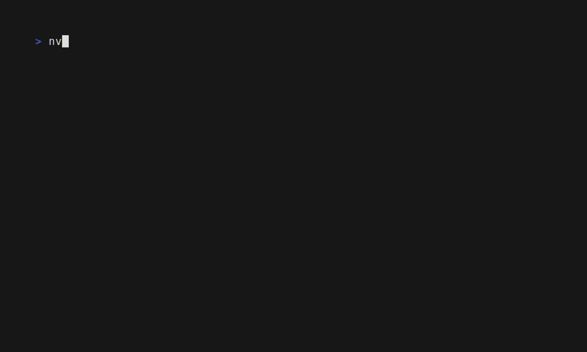

# tunnelvision.nvim


Focus on one thing at a time.

TunnelVision dims unrelated lines and keeps attention on the targeted symbol.



## Installation

Requires Neovim `>= 0.9`. Tree-sitter is optional but recommended for scope and
syntax-aware matching; LSP matching requires `documentHighlight` support.

<details open>
<summary><code>lazy.nvim</code></summary>

```lua
{
  "leolaurindo/tunnelvision.nvim",
  opts = {},
}
```

</details>

<details>
<summary><code>vim.pack</code> (Neovim 0.12+)</summary>

```lua
vim.pack.add({ "https://github.com/leolaurindo/tunnelvision.nvim" })
require("tunnelvision").setup()
```

</details>

<details>
<summary><code>mini.deps</code></summary>

```lua
MiniDeps.add({ source = "leolaurindo/tunnelvision.nvim" })
require("tunnelvision").setup()
```

</details>

<details>
<summary><code>packer.nvim</code></summary>

```lua
use({
  "leolaurindo/tunnelvision.nvim",
  config = function()
    require("tunnelvision").setup()
  end,
})
```

</details>

## Basics

Put the cursor on a symbol, run `:TunnelVision on`, navigate with
`:TunnelVision next` and `:TunnelVision prev`, then finish with
`:TunnelVision off`.

See [suggested keymaps](#suggested-keymaps)

## Modes, Sources, and Highlights

### Modes

| Mode | Behavior |
| --- | --- |
| `static` (default) | Tracks the symbol selected on activation. |
| `dynamic` | Retargets as the cursor moves. |
| `flow` | Experimentally expands the selected path through assignment relationships. |

### Sources

`sources` is an ordered fallback chain: each source is tried until one returns
usable lines. The default is `{ "lsp", "treesitter", "word" }`.

| Source | Behavior |
| --- | --- |
| `lsp` | Semantic and async; most precise when the server supports `documentHighlight`. |
| `treesitter` | Syntax-aware and lightweight; not semantic. |
| `word` | Broad, language-agnostic whole-word matching. |

LSP falls through after `lsp_timeout_ms` when slow or unavailable. For an
LSP-free setup, `{ "treesitter", "word" }` pairs well with `scope = function`.

Use `combine(...)` for a strict "all" step. Every member must return matches;
their lines are merged on success, or the chain continues on failure:

```lua
local tv = require("tunnelvision")

tv.setup({
  sources = {
    tv.combine("lsp", "treesitter"),
    "treesitter",
    "word",
  },
})
```

In commands, commas mean fallback order; strict combinations are Lua-only:

```vim
:TunnelVision source lsp,word
:TunnelVision source treesitter,word
:TunnelVision source lsp,treesitter,word
```

### Highlights

`highlights` controls which contexts stay focused and optionally gives them a
positive style:

| Context | Range |
| --- | --- |
| `scope_head` | First line of enclosing function, conditional, loop, and clause heads found by Tree-sitter. |
| `statement` | Nearest recognized declaration or statement around each path occurrence, clipped to the active scope and limited to 50 lines. |
| `line` | Complete source and flow path lines. |
| `symbol` | Exact symbol. With only this enabled, the rest of matched lines stays dimmed. |

A missing key or `false` disables a context. `true` or `{}` preserves its
original syntax colors; a style table applies `fg`, `bg`, `bold`, `italic`,
`underline`, `undercurl`, `strikethrough`, or `bg_opacity`. Numeric opacity is
clamped to `0..1` and pre-blended against `Normal`, not alpha-blended; without
usable backgrounds, the configured `bg` is used unchanged.

Overlaps compose from `scope_head` to `statement` to `line` to `symbol`: more
specific contexts override only the attributes they define.

```lua
require("tunnelvision").setup({
  highlights = {
    scope_head = { bold = true },
    statement = true,
    line = { bg = "#292e42", bg_opacity = 0.2 },
    symbol = { fg = "#f7768e", bold = true, underline = true },
  },
  dim = { fg = "#565f89", italic = true },
})
```

Omitted or empty `highlights` defaults to `{ line = true }`. A non-empty table
replaces that default; it is not merged. Useful variations include:

```lua
{ highlights = { symbol = true } } -- token-only focus, original colors
{ dim = "none", highlights = { symbol = { bold = true } } } -- no dimming
```

Symbol ranges come from the winning source: LSP ranges, exact Tree-sitter
identifier nodes, or whole-word matches outside masked strings/comments. Custom
source lines derive ranges where the active symbol occurs; flow adds ranges for
tracked identifiers.

`statement` and `scope_head` use Tree-sitter independently of `sources`. If
structure is unavailable, statements fall back to path lines and scope heads are
skipped. Lookup starts at exact symbol columns, or the first nonblank column for
custom lines without ranges. Structural lines are visual only: `next` and `prev`
still navigate the source/flow path; warnings follow `fallback_warn` and `notify`.

## Configuration

`setup()` defines persistent defaults; `on(opts)` accepts one-shot overrides for
`mode`, `scope`, `sources`, `flow_settings`, `highlights`, and `dim`.

| Option | Default | Notes |
| --- | --- | --- |
| `mode` | `static` | `static`, `dynamic`, or experimental `flow`. |
| `scope` | `function` | Nearest function-like Tree-sitter scope, falling back to the full buffer; also accepts `buffer`. |
| `sources` | `{ "lsp", "treesitter", "word" }` | Ordered source fallback chain. |
| `flow_settings.direction` | `forward` | `forward`, `backward`, or `both`. |
| `flow_settings.extra_keywords` | `{}` | Extra identifiers ignored during flow analysis. |
| `flow_settings.analyzers` | `{ "treesitter", "text" }` | Ordered analyzer fallback; use one item for strict behavior. |
| `flow_settings.max_depth` | `nil` | Positive hop limit; `nil` uses the internal 32-hop guard. |
| `fallback_warn` | `once` | Legacy LSP fallback and structural warnings: `once` per buffer, `always`, or `never`. Strict LSP still warns once. |
| `lsp_timeout_ms` | `150` | Async LSP `documentHighlight` timeout. |
| `highlights` | `{ line = true }` | Enabled visual contexts and their positive styles. [See configs](#highlights) |
| `dim` | `nil` | `nil` derives from `Comment`; accepts `"none"`, a highlight group, hex foreground, or style table. |
| `max_dim_lines` | `6000` | Skip dimming in larger buffers. |
| `notify` | `true` | Enable plugin notifications. |

Flow analyzers are separate from sources: sources select the initial path, then
the first usable analyzer expands assignments. `forward` follows dependencies to
dependents, `backward` finds inputs feeding the symbol, and `both` combines them.
Tree-sitter analysis falls back silently to text by default. `status()` reports
the analyzer, fallback state, tracked identifiers, and flow-added lines.

One-shot options do not change setup defaults:

```lua
require("tunnelvision").on({
  mode = "dynamic",
  scope = "buffer",
  sources = { "word" },
  highlights = { line = { bg = "#292e42", bg_opacity = 0.2 } },
})
```

In `on(opts)`, omitted `highlights` inherits setup; an empty table selects line
focus; a non-empty table replaces the setup rules for that activation.

Run `:help tunnelvision-config` for the full option reference.

## Commands

```text
:TunnelVision on|retarget|off|toggle|next|prev|refresh|status
:TunnelVision mode [static|dynamic|flow]
:TunnelVision scope [function|buffer]
:TunnelVision source [lsp|treesitter|word|lsp,word|treesitter,word|lsp,treesitter,word|lsp_else_word|lsp_and_word]
:TunnelVision direction [forward|backward|both]
```

`retarget` is an alias for `on`. Commands with optional arguments show or change
their persistent default; `status` describes the active buffer. Run
`:help tunnelvision` for the complete command and Lua API reference.


### Suggested keymaps
```lua
local tv = require("tunnelvision")

vim.keymap.set("n", "<leader>v", "<cmd>TunnelVision on<CR>", { desc = "TunnelVision on" })
vim.keymap.set("n", "]v", "<cmd>TunnelVision next<CR>", { desc = "TunnelVision next" })
vim.keymap.set("n", "[v", "<cmd>TunnelVision prev<CR>", { desc = "TunnelVision prev" })
vim.keymap.set("n", "<Esc>", function()
  if tv.is_active() then
    tv.off()
    return ""
  end
  return "<Esc>"
end, { expr = true, silent = true, desc = "TunnelVision off on Esc" })

vim.keymap.set("n", "<leader>V", function()
  tv.on({ scope = "buffer", sources = { "word" } })
end, { desc = "TunnelVision word in buffer" })
```

Use `toggle` instead of `on` in the first mapping if preferred.

## Custom Sources

Register a synchronous Lua function before using its name in `sources`. This
example defines an `assertions` source; it is not built in:

```lua
local tv = require("tunnelvision")

tv.register_source("assertions", function(ctx)
  local matches = {}
  local lines = vim.api.nvim_buf_get_lines(
    ctx.bufnr,
    ctx.scope.start_line - 1,
    ctx.scope.end_line,
    false
  )

  for offset, text in ipairs(lines) do
    local symbol = "%f[%w_]" .. vim.pesc(ctx.symbol) .. "%f[^%w_]"
    if text:find("assert", 1, true) and text:find(symbol) then
      matches[ctx.scope.start_line + offset - 1] = true
    end
  end

  return matches
end)

tv.setup({ sources = { "lsp", "assertions", "word" } })
```

The handler receives `bufnr`, `symbol`, `anchor`, `scope`, `mode`, `direction`,
and `keywords`. Return a line set such as `{ [3] = true, [8] = true }`. `nil`,
`false`, an empty table, or an error continues the chain; invalid and out-of-scope
lines are ignored.

Custom sources work in `combine(...)`. They are synchronous and Lua-only, so
`:TunnelVision source` does not accept them. Built-in and legacy names cannot be
replaced.

## Compatibility and Project

Legacy options remain supported without runtime deprecation warnings, but new
configuration should use the composable forms:

| Old | New |
| --- | --- |
| `source = "word"` | `sources = { "word" }` |
| `source = "lsp"` | `sources = { "lsp" }` |
| `source = "lsp_else_word"` | `sources = { "lsp", "word" }` |
| `source = "lsp_and_word"` | `sources = { tv.combine("lsp", "word") }` |
| `direction = "both"` | `flow_settings = { direction = "both" }` |
| `extra_keywords = { ... }` | `flow_settings = { extra_keywords = { ... } }` |
| `dim_hl = "..."` | `dim = ...` |

Version 0.4 requires no migration: without `highlights`, old and new setups keep
line focus with Comment-derived dimming.

Run `:checkhealth tunnelvision` to check Neovim, Tree-sitter, LSP highlighting,
and the dim highlight. Contributions are welcome; include the rationale and
update the documentation and `CHANGELOG.md`.

# Other approaches:

- [folke/twilight.nvim](https://github.com/folke/twilight.nvim)
- [RRethy/vim-illuminate](https://github.com/RRethy/vim-illuminate)
- [junegunn/limelight.vim](https://github.com/junegunn/limelight.vim)
